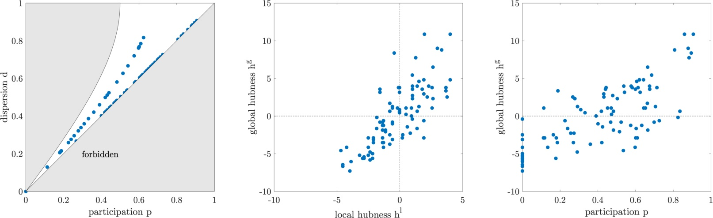

# participationCoefficient
Participation and dispersion of nodes in a network with community structure

This code is for Matlab. You can find a Python version in the [GAlib](https://github.com/gorkazl/pyGAlib) by Gorka Zamora-López.

The code is tested on Matlab R2016b. No other libraries are needed but we suggest [GenLouvain](https://github.com/GenLouvain/GenLouvain) for the community detection.

We provide an example for the Cat cortex graph, as provided by the [Brain Connectivity Toolbox](https://sites.google.com/site/bctnet/). For your convenience, we pre-computed a modular structure, as detected by GenLouvain.

Executing `catCortexExample.m` should create the image below.

If used, please cite our paper [Open Acess Link](https://iopscience.iop.org/article/10.1088/1367-2630/16/12/125006)
Klimm, F., Borge-Holthoefer, J., Wessel, N., Kurths, J., & Zamora-López, G. (2014). Individual nodeʼs contribution to the mesoscale of complex networks. New Journal of Physics, 16(12), 125006.
